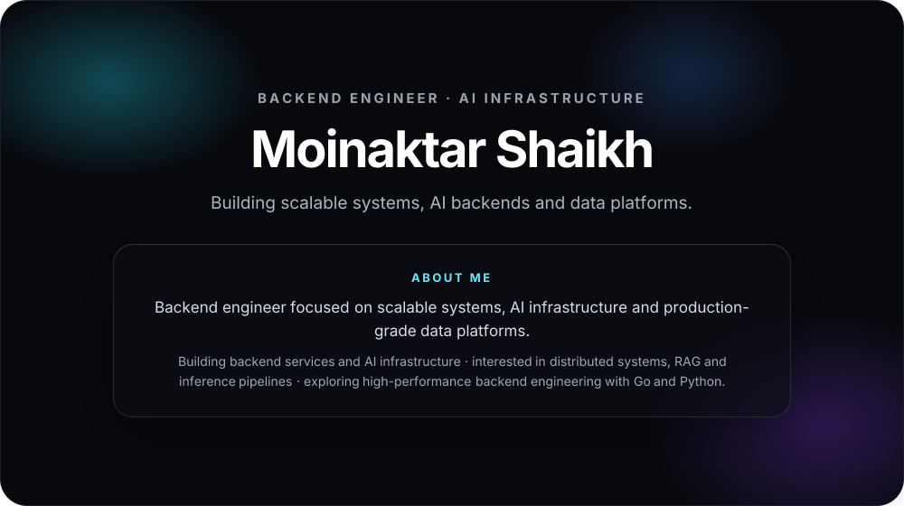
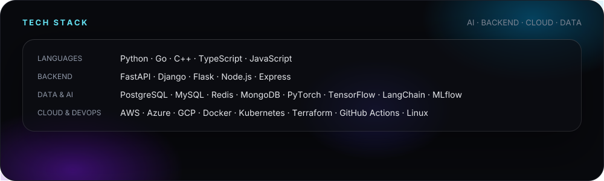

## GitHub Stats

  
  

## Certifications

  

## Connect

  <a href="https://www.linkedin.com/in/moinaktar-shaikh-7b3a33207/">LinkedIn</a> ·
  <a href="mailto:moinaktarshaikh@gmail.com">Email</a> ·
  <a href="https://leetcode.com/u/Moinaktar/">LeetCode</a>

