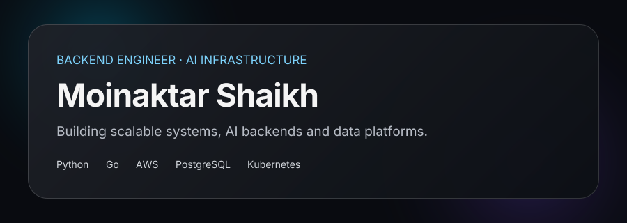
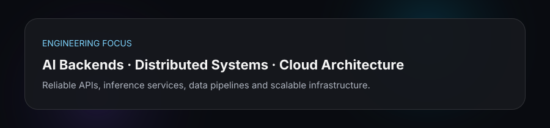
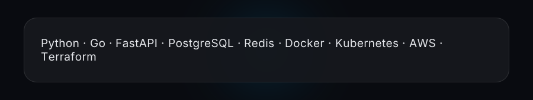

## About Me

Backend engineer focused on scalable systems, AI infrastructure and production-grade data platforms.

* Building backend services and AI infrastructure
* Interested in distributed systems, RAG and inference pipelines
* Exploring high-performance backend engineering with Go and Python
* Based in Bengaluru, India

## Tech Stack

## GitHub

  

## Certifications

  

## Connect

  <a href="https://www.linkedin.com/in/moinaktar-shaikh-7b3a33207/">LinkedIn</a> ·
  <a href="mailto:moinaktarshaikh@gmail.com">Email</a> ·
  <a href="https://leetcode.com/u/Moinaktar/">LeetCode</a>

<!-- readme-aura rebuild trigger -->
